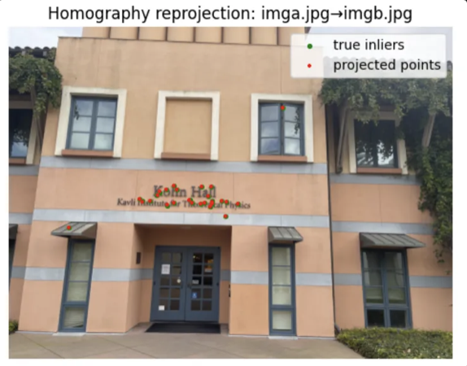

# Auto Feature Extraction and Matching  

---

## 1. Pipeline Overview

This project implements an automated feature extraction and matching pipeline using the HLOC framework with learning-based keypoint detectors and matchers.

### Steps:
- **Dataset**: Images stored in `datasets/front-door/`, output in `outputs/milestone2/`. (Change them to your file path)
- **Feature Extraction**: Using HLOC presets; saved as `features.h5`.
- **Pair Generation**: All unordered image pairs via `pairs_from_exhaustive`.
- **Feature Matching**: Saved as `matches.h5`.
- **Geometric Evaluation**:
  - Homographies estimated and validated by reprojection error.
  - Fundamental matrices estimated with RANSAC and verified with epipolar lines.

---

## 2. Homography Estimation

### img_a ↔ img_b
- Valid matches: 627  
- Mean error: **1.45**, Max error: **3.61**  
-   
**Notes**: Accurate near center; slight drift at boundaries.

### img_a ↔ img_c
- Valid matches: 834  
- Mean error: **1.70**, Max error: **3.42**  
-   
**Notes**: Reliable central alignment; corners affected by viewpoint change.

### img_b ↔ img_c
- Valid matches: 1525  
- Mean error: **1.71**, Max error: **3.75**  
-   

All homographies produced visually and numerically consistent results with low mean reprojection errors (< 2.0).

---

## 3. Fundamental Matrix & Epipolar Validation

### img_a ↔ img_b
- 

### img_a ↔ img_c
- 

### img_b ↔ img_c
- 

**Observations**:
- All epipolar lines are horizontal, indicating lateral camera motion.
- img_b ↔ img_c shows strongest consistency.
- img_a ↔ img_c suffers more distortion due to viewpoint changes.
- RANSAC effectively rejects outliers.

---

## 4. Comparison: SuperPoint vs. DISK

### img_a ↔ img_b (DISK + LightGlue)
- Matches: 230  
- Mean error: **1.54**, Max: **2.97**  
-   
-   
**Notes**: Good perspective modeling, consistent epipolar lines.

### img_a ↔ img_c
- Matches: 441  
- Mean error: **1.56**, Max: **2.85**  
-   
-   
**Notes**: Accurate alignment, well-behaved epipolar geometry.

### img_b ↔ img_c
- Matches: 2116  
- Mean error: **1.60**, Max: **3.96**  
-   
-   
**Notes**: Excellent geometric consistency; robust match quality.

---

## 5. RANSAC Verification

### SuperPoint + SuperGlue
- Initial matches: ~600–1500  
- After RANSAC: ~500–1300  
- Errors: Mean reprojection ~1.4–1.6 px  
- Some edge matches removed, but overall quality improved.

### DISK + LightGlue
- High-overlap pairs (e.g., b↔c): over 3000 matches, kept 2116  
- Low-overlap pairs (e.g., a↔b): few matches pruned  
- Some true matches discarded due to wide spread.

**Summary**:
- **SuperPoint** offers consistent performance across varied scenes.  
- **DISK** excels in dense, overlapping views.  
- RANSAC significantly improves match quality for both.
