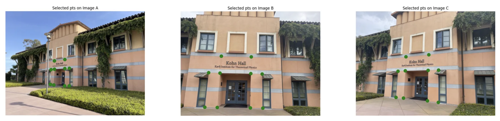
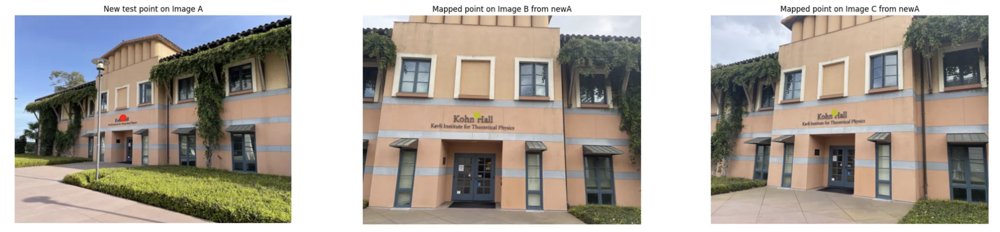
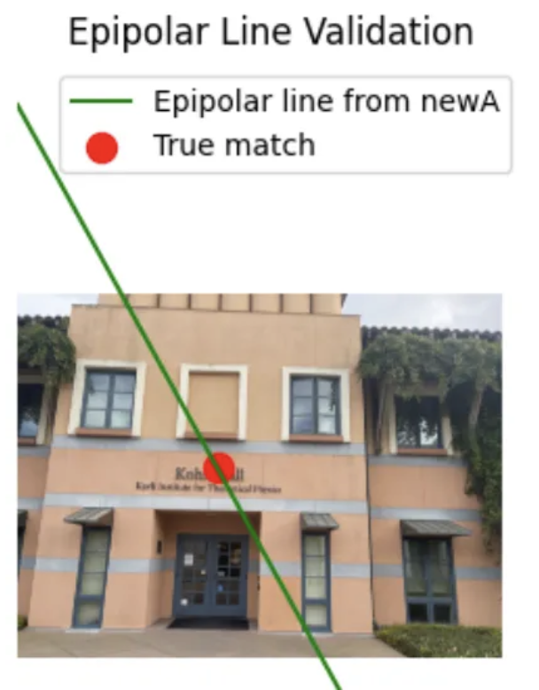
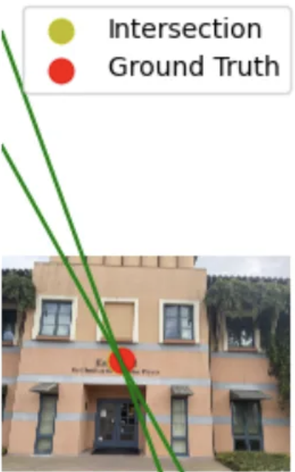

# Planar Homography and Epipolar Geometry

## Objective

This milestone focuses on understanding projective geometry by manually selecting corresponding points across three images and estimating the geometric relationships among them.

The primary goals include:

- Selecting corresponding points using a GUI-based OpenCV tool.
- Estimating homography matrices between image pairs.
- Validating the reprojection accuracy of homographies.
- Estimating fundamental matrices and visualizing epipolar geometry.
- Performing a cross-view consistency check.

---

## Manual Correspondences

We used an OpenCV-based point selection tool to manually select 10 correspondences across three images (Image A, B, C).

These points were saved in CSV format and visualized to ensure spatial alignment:
| ImageA_x | ImageA_y | ImageB_x | ImageB_y | ImageC_x | ImageC_y |
|----------|----------|----------|----------|----------|----------|
| 1315.0   | 1693.0   | 806.0    | 1774.0   | 1216.0   | 1731.0   |
| 1295.0   | 2123.0   | 695.0    | 2773.0   | 1159.0   | 2491.0   |
| 1411.0   | 1681.0   | 1132.0   | 1785.0   | 1426.0   | 1721.0   |
| 1396.0   | 2137.0   | 1056.0   | 2782.0   | 1374.0   | 2516.0   |
| 1716.0   | 1663.0   | 2021.0   | 1798.0   | 2089.0   | 1708.0   |
| 1705.0   | 2167.0   | 2006.0   | 2792.0   | 2069.0   | 2594.0   |
| 1845.0   | 1654.0   | 2348.0   | 1811.0   | 2387.0   | 1703.0   |
| 1842.0   | 2167.0   | 2366.0   | 2798.0   | 2384.0   | 2635.0   |
| 1413.0   | 1440.0   | 1168.0   | 1298.0   | 1447.0   | 1318.0   |
| 1714.0   | 1398.0   | 2036.0   | 1316.0   | 2104.0   | 1256.0   |
We used these correspondences for homography and fundamental matrix estimation.

---

## 🔄 Homography Estimation

We used OpenCV's `findHomography()` with RANSAC to compute the homography matrices $begin:math:text$ H_{AB} $end:math:text$ and $begin:math:text$ H_{AC} $end:math:text$.

**H_AB =**

|        |           |             |
|--------|-----------|-------------|
| 6.27   | -0.27     | -6476.98    |
| 1.58   | 3.27      | -4753.41    |
| 6.77×10⁻⁴ | -1.62×10⁻⁴ | 1.00        |

**H_AC =**

|        |           |             |
|--------|-----------|-------------|
| 1.60   | -0.13     | -876.63     |
| -0.094 | 1.30      | -653.94     |
| -8.87×10⁻⁵ | -3.67×10⁻⁵ | 1.00        |

### Analysis

- In $begin:math:text$ H_{AB} $end:math:text$, the large values in the translation components (−6476.98, −4753.41) indicate a significant shift in viewpoint. The top-left 2×2 submatrix shows strong scaling and shearing, suggesting notable geometric deformation. The third row confirms the presence of perspective distortion.
- In contrast, $begin:math:text$ H_{AC} $end:math:text$ reflects a moderate transformation. The translation values are smaller (−876.63, −653.94), and the matrix is closer to an affine transform with very small perspective terms, implying that Image C was taken from a more similar viewpoint to A.

We validated both matrices by selecting a new point in Image A and projecting it to Images B and C. The projected results aligned closely with true points.

---

## 📐 Fundamental Matrix Estimation

We used OpenCV's `findFundamentalMat()` with RANSAC to estimate $begin:math:text$ F_{AB} $end:math:text$.

**F_AB =**

|              |              |              |
|--------------|--------------|--------------|
| 1.56×10⁻⁷     | -1.56×10⁻⁷    | 4.04×10⁻⁴     |
| 1.12×10⁻⁷     | 3.30×10⁻⁹     | -4.12×10⁻⁴    |
| -1.55×10⁻³    | 7.24×10⁻⁴     | 1.00          |
To validate this matrix, we selected a point in Image A, computed its epipolar line in Image B, and marked the true match.

- ✅ Green line: predicted epipolar line  
- ✅ Red dot: manually selected true corresponding point  

The red dot lies closely along the predicted line, visually confirming the correctness of $begin:math:text$ F_{AB} $end:math:text$.

---

## 🔁 Cross-View Consistency Check

To evaluate multi-view consistency:

1. A point in Image A was projected into Image C using $begin:math:text$ H_{AC} $end:math:text$.
2. Epipolar lines in Image B were computed using $begin:math:text$ F_{AB} $end:math:text$ and $begin:math:text$ F_{CB} $end:math:text$.
3. Their intersection was compared to the manually selected true match in B.

### Results

- Epipolar lines intersect at: (1663.53, 1446.75)  
- Ground-truth point: (1668.00, 1449.00)  
- Euclidean error: **5.01 px**

Despite a ~5 pixel error, the epipolar lines nearly intersect at the annotated ground-truth location, confirming the estimated fundamental matrices are geometrically consistent.

---

## 💻 Code Summary

We implemented the following:

- `select_points()` and `select_triplets()` using OpenCV callbacks
- `findHomography()` and `findFundamentalMat()` using RANSAC
- `computeCorrespondEpilines()` and Matplotlib for visualization
- All selected points saved to `manual_correspondences.csv`

---

## ✅ Conclusion

This milestone provided hands-on experience with manual point selection, transformation estimation, and multi-view geometry validation. The homography matrices revealed differences in viewpoint and planar alignment, while the fundamental matrices accurately described epipolar constraints. All observations align with theoretical expectations and support the use of these tools in more complex automated pipelines.
